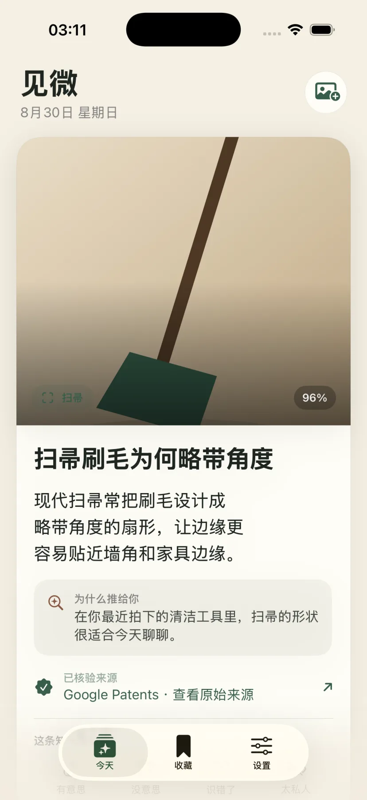

# Jianwei · 见微

[简体中文](README.zh-CN.md) · [Product story](https://yuqin.wang/#/project/jianwei) · [Development guide](#run-the-public-snapshot)

**Discover a little knowledge in your everyday photos.**

Jianwei explores the ordinary objects in a personal photo library and turns suitable photos into daily knowledge cards with traceable sources. It is for people who want a small moment of curiosity in their everyday life.



*Development preview from the personal website. This interface comes from ongoing product work and is not a promise that the public snapshot reproduces the same build.*

## Current stage

**In development; no public app download yet.** Current product work focuses on iPhone. This public repository contains an earlier Android, iOS, and backend engineering snapshot. Final content-quality acceptance, device and cross-day widget checks, and production distribution remain release gates. A local build or passing test does not establish those results.

## The idea

1. Start from everyday photos instead of a generic feed.
2. Filter unsuitable images on the device before analysis.
3. Match eligible objects to knowledge and sources; leave a gap when no reliable match exists.
4. Bring a small card back into daily life through the app and widget.

The checked-in snapshot and its exact technical behavior are described in the [implementation status](docs/IMPLEMENTATION_STATUS.md), [privacy design](docs/PRIVACY.md), and [architecture](docs/ARCHITECTURE.md).

## Run the public snapshot

This is a developer checkout, not an installation package for end users.

### Local backend

Requires Node.js 20.12+ and pnpm 11.

```bash
git clone https://github.com/wangyuqin378-cpu/jianwei.git
cd jianwei/backend
cp .env.example .env
pnpm install
pnpm test
pnpm dev
```

Keep `VISION_PROVIDER=local` for the local provider path, which does not require a cloud model key. The default backend address is `http://127.0.0.1:8787`.

### iOS engineering project

Requires macOS, Xcode, and XcodeGen.

From the repository root:

```bash
cd ios
xcodegen generate
xcodebuild -project Jianwei.xcodeproj -scheme Jianwei \
  -destination 'platform=iOS Simulator,name=iPhone 17 Pro' test
```

Replace the simulator name with one installed on your Mac. Simulator checks do not cover distribution signing or physical-device acceptance.

### Android engineering project

The public snapshot retains the earlier Android implementation. See the [Chinese development instructions](README.zh-CN.md#android); Android is not the current product release focus.

## Repository map

| Directory | Contents |
| --- | --- |
| `ios/` | iOS app, widget, and tests |
| `android/` | Earlier Android app and widget implementation |
| `backend/` | API, model providers, storage, and tests |
| `knowledge/` | Topics, facts, sources, and review state |
| `docs/`, `scripts/` | Architecture, checks, and release evidence tooling |

## Read more

[Privacy](docs/PRIVACY.md) · [Deployment](docs/DEPLOYMENT.md) · [Beta evidence](docs/BETA_EVIDENCE_RUNBOOK.md) · [Completion audit](docs/COMPLETION_AUDIT.md)

## Source availability

The source is public for inspection. This repository currently has no open-source license; public visibility does not grant an open-source license.
